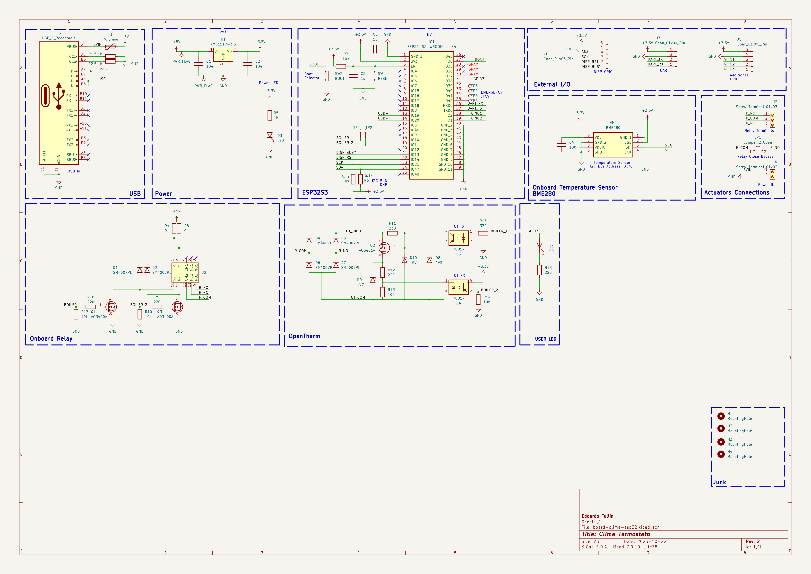
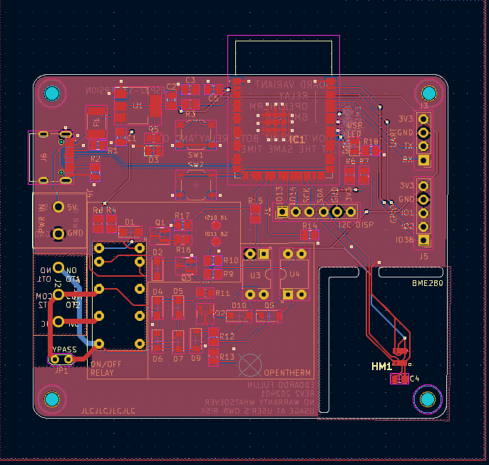
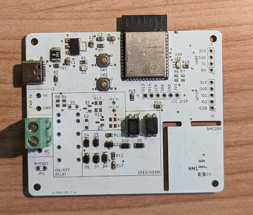

# ESP32-Clima

This repository contains the design and production files that I used to build by own ESP32-based OpenTherm* and ON/OFF thermostats.

The devices is based on a ESP32-S3 microcontroller, and can include *exclusively* a OpenTherm driver circuit or a latching on/off relay to drive the boiler. 
Optionally, a BME280 sensor can be soldered onto the board in order to measure temperature, humidity and pressure (and use them for control).

## Schematic

## PCB Design

## Final Result (OpenTherm version)

## Disclaimers

I'm an not a PCB designer / electronics professional, everything here is provided for free and the user assumes all resposibilities of what they do with the material.
This material comes AS-IS with ABSOLUTELY NO WARRANTY.

*I'm **NOT** affiliated with the [OpenTherm Association](https://www.opentherm.eu/) in any way, the circuit has **only** been tested by me on my own boiler and is not guaranteed to work on every boiler.

The OpenTherm circuit part is heavily inspired by [this](https://electronics.stackexchange.com/questions/466720/how-does-this-circuit-work-opentherm) StackExchange post.  
